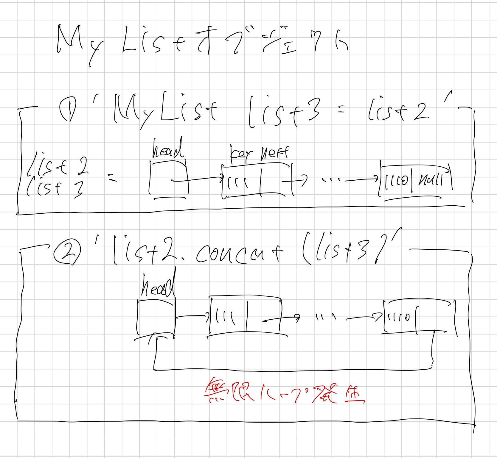

# 第3回課題レポート
学籍番号：AL23088
氏名：嶋中雄大

## 3.1【通常課題】オブジェクトの代入（参照渡し）

実行結果が以下のようになった理由について説明する

1. `Chokin a = new Chokin();`によって`Chokin`クラスのインスタンスが生成され,コンストラクタが呼び出される.
この時,`okane`インスタンス変数が10000で初期化される.

2. `a.addOkane(5000);`によって`addOkane()`メソッドが呼び出され,`okane`インスタンス変数に5000が加算される.結果,`okane`は15000となる.

3. `Chokin b = a;`によってオブジェクトの参照渡しが行われる.
これにより,`b`は`a`と同じオブジェクトを参照するようになる.

4. `b.addOkane(30000);`によって,`b`（すなわち`a`と同じオブジェクト）の`okane`変数に30000が加算される.
結果,`okane`は45000となる.

5. `a.print()`と`b.print()`で`okane`の値が出力される.
両者は同じオブジェクトを参照しているため,同じ値（45000）が表示される.

オブジェクト型変数は変数の値へ直接代入するのではなく,変数のアドレスを保持する.
そのため,`Chokin b = a;`という操作によって,`b`は`a`と同一のオブジェクトを参照するようになるため,同じ値が表示されました.

## 3.2【通常課題】クラスの継承

コンストラクタの呼び出し順序と処理は以下のように考えられます.

1. BankAccount クラスのコンストラクタ呼び出し
   - `BankAccount("OsakaBank")` が呼び出される.

2. 親クラス Chokin のコンストラクタ呼び出し：
   - 子クラスのコンストラクタは最初によって親クラスのコンストラクタが呼び出される.
   - Chokin クラスのデフォルトコンストラクタが実行され,`okane = 10000` が設定される.

3. BankAccount クラスのコンストラクタの処理：
   - `this.bank = bank;` が実行され,bank フィールドに "OsakaBank" が代入される.

4. main メソッド内の処理：
   - `bank1.addOkane(5000);` が実行され,親クラスから継承した addOkane メソッドにより okane が 15000 に増加.
   - `bank1.print();` が呼び出され,オーバーライドされた print メソッドが実行される.

この順序で処理が行われた理由：

1. 継承によって子クラスのコンストラクタが親クラスのコンストラクタを先に呼び出すことによって親クラスの初期がが行われる.

2. 親クラスの初期化完了後,子クラスの固有の初期化処理が行われる.

## 3.3 【通常課題】データ構造の復習（連結リスト）

MyListクラスの3つのメソッド(add,indexOf,get)の内部の処理手順の説明をする.

### 1. addメソッド
addメソッドは,リストの末尾に新しい要素を追加するメソッド.
1. 新しいListNodeオブジェクトを,引数xをkeyとして生成する.
2. リストが空(`head == null`)の場合,新しいノードをheadに設定する.
3. リストが空でない場合
    - 現在のノード(current)をheadから開始する.
    - currentのnextがnullでない間,currentのノードを進める.
    - リストの最後に到達したら,currentのnextに新たなノードを設定する.

### 2. getメソッド
getメソッドは,指定されたインデックスnの要素の値を返すメソッド.
1. 現在のノードpをheadに設定し,カウンタ変数であるcntを0で初期化する.
2. pがnullでない間,pのkeyの値がxと等しくなるまでcntをインクリメントし,pのノードを進める.keyとxが等しい場合,cntを返す.
3. リストの最後に到達しても見つからなかった場合-1を返す.

### 3.get メソッド
getメソッドは,指定されたインデックスnの要素の値を返す.
1. 現在のノードpをheadに設定し,カウンタ変数であるcntを0で初期化する.
2. pがnullでない間,pのkeyの値がxと等しくなるまでcntをインクリメントし,pのノードを進める.keyとxが等しい場合,oのkeyを返す.
3. リストの最後に到達しても見つからなかった場合,`IndexOutOfBoundsException`を投げる.

## 3.4【発展課題】連結リスト課題の続き
Test03Dのmainメソッドの最後に3行を追加し実行しました.
### 予想される出力
無限ループになりプログラムが終了しなくなると予想される.
### 実際の実行結果
プログラムは無限ループに陥り数字の繰り返しが続きました.
具体的には以下のような出力が得られました.
```
argo@ArgoHP:~/projects/class/Kiso_2A/src/lesson3$ java Test03D
100 200 300 400 500 600 700 800 900 111 222 333 444 555 666 777 888 999 1110 
100 200 300 400 500 600 700 800 900 111 222 333 444 555 666 777 888 999 1110 111 222 333 444 555 666 777 888 999 1110 111 222 333 444 555 666 777 888 999 1110 111 222 333 444 555 666 777 888 999 1110
```

### 結果の説明(図)
この結果が得られた理由を,以下の図で説明します.


### 結果の説明
1. オブジェクト型変数は参照を保持するため,`MyList list3 = list2`で両者が同じリストを参照することになりました.

2. `concat`によってlist2の最後のノードのnextにlist3のheadのアドレスを接続,list2とlist3は同一アドレスの変数を参照しているため同一リストの最後のノードのnextとheadが繋がり犬が自分の尻尾を追いかけ回しているような状態になりました.

3. `print`メソッドは`null`が現れるまで要素を出力するが`null`がheadのアドレスになったため,永遠に要素を出力し続けることになりました.
(正確にはメモリの容量が尽きるまで)